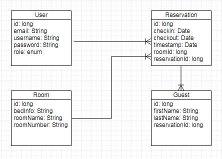
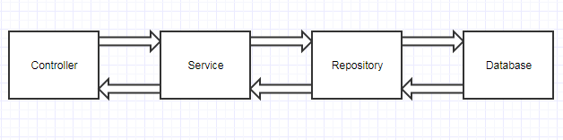

# alkfejlProject

# Feladat
Az alkalmazás egy hotel szobafoglalásait valósítja meg. Sima felhasználóként és adminként van lehetőségünk belépni, illetve van lehetőség regisztrációra. 
Userként belépve tudunk szobát foglalni egy megadott időintervallumban az aktuálisan szabad szobák közül, illetve opcionálisan vendégeket rendelni az adott foglaláshoz, illetve megtekinteni az adott foglaláshoz rendelt összes vendéget. Ezen kívül lehetőseg van a vendég adatainak megváltoztatására.
Ezen felül adminként belépve láthatjuk mindenki foglalását, illetve az azokhoz tartozó vendégeket.

# Alkalmazások fejlesztése 2017 projekt
Ez az alkalmazás az alkalmazások fejlesztése 2017-es őszi gyakorlatára készült Spring Boot segítségével MVC pattern alapján, valamint egy Angular frontend, amely a felhasználói felületet biztosítja. Az adatokat H2 adatbázisban tárljuk a memóriában. 

### Funkcionális Követelmények:
##### Minden felhasználóra vonatkozóan:
* Regisztráció
* Bejelentkezés
* Kijelentkezés
* Adott időintervallumban szabad szoba foglalása
* Saját foglalások megtekintése
* Adott foglaláshoz opcionálisan vendégek rendelése
* Adott foglaláshoz tartozó vendégek megtekintése
* Adott foglaláshoz tartozó vendégek módosítása
* Adott foglaláshoz tartozó vendég törlése

##### Adminisztrátor(ok)ra vonatkozóan:
* Az összes felhasználó foglalásainak megtekintése
* Az összes foglaláshoz tartozó vendégek megtekintése
* Foglalás törlése

### Nem Funkcionális Követelmények:
* Biztonság: 
    - jelszavak hashelése
    
### Szakmai Fogalmak:
* Bedinfo: Ágyakra vonatkozó rövidítéseket tartalmazza
  - A szám az adott típusból a szobákhoz tartozó ágyak számát jelöli
  - Az utána lévő betűk a típusokat(E - extra, L - Large, D -double)
* Roomnumber:
  - A benne szereplő betűk a szoba nevének kezdőbetűi
  - A roomnumber végén található szám az adott típusú szobák megkülönböztetésére szolgál
 
### Szerepkörök
* Adminisztrátor
* Felhasználó

## Backend megvalósítása

### Fejlesztői környezet: NetBeans

#### Felhasznált eszközök

* Spring Boot
* Maven
* JPA
* H2
* Lombok
* Git, GiHub
* Postman, ARC (teszteléshez)

## Frontend megvalósítása

### Fejlesztői környezet: Visual Studio Code

#### Felhasznált eszközök
 * Node.js
 * Angular
 
#### Adatbázis-terv

#### Végpontok

### User:
 * POST api/user/login : bejelentkezés
 * POST api/user/logout : kijelentkezés
 * POST api/user/register : regisztrálás

### Reservation:
 * GET api/reservation/reservations/all : összes foglalás
 * GET api/reservation/reservations/free/{checkin},{checkout} : szabad szoba keresése
 * GET api/reservation/reservations/{checkin},{checkout} : szobák keresése
 * GET api/reservation/reservations/{id} : foglalás törlése
 * POST api/reservation/createreservation : foglalás
 * GET api/reservation/guest/all/{id} : adott id-jú foglaláshoz tartozó összes vendég
 * POST api/reservation/guest : vendég hozzárendelése foglaláshoz
 * PUT api/reservation/guest/{id} : vendég adatainak frissítése
 
#### Adatáramlás backend oldalon:

#### Fejlesztői környezet beállítása, indítása
### Backend
  * A pom.xml tartalmazza a használt függőségeket
  * az application.properties-ben a h2-re vonatkozó beállításokat alkalmaztunk
  * az import.sql fájlból az alkalmazás indításakor feltölti a generált táblákat
  * indítás grafikus környezetből(NetBeans) vagy parancssorból: mvn spring-boot:run paranccsal.

### Fronend
  * npm install segítségével a függőségeket telepítjük
  * npm start segítségével elindítjuk a frontendet
  
### Látványterv

  
